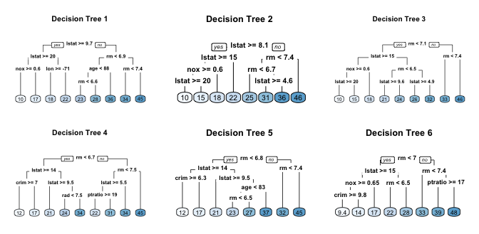
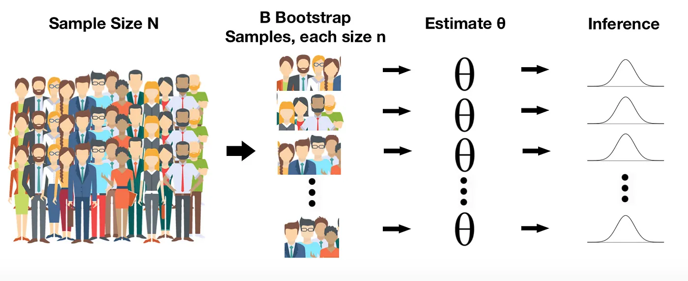
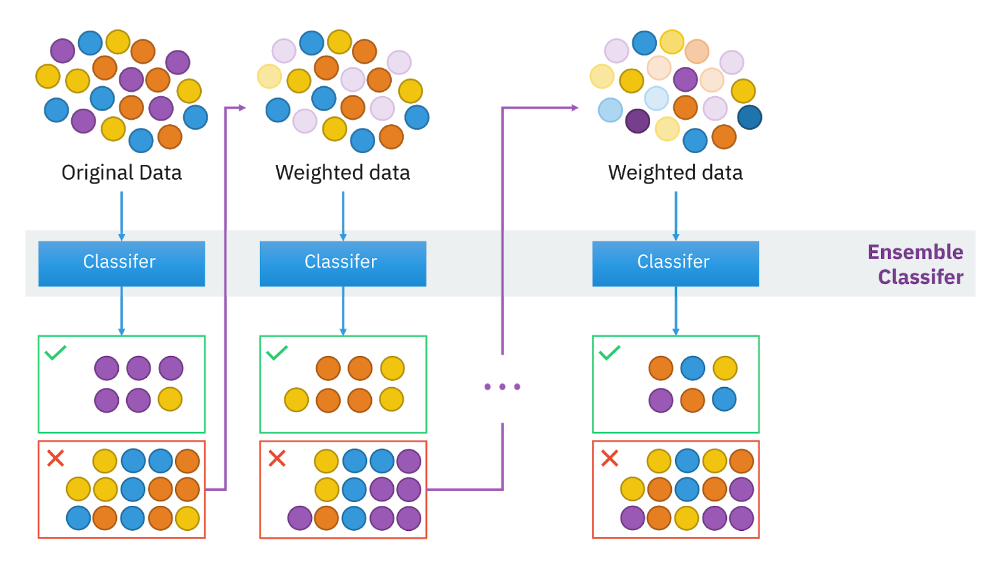
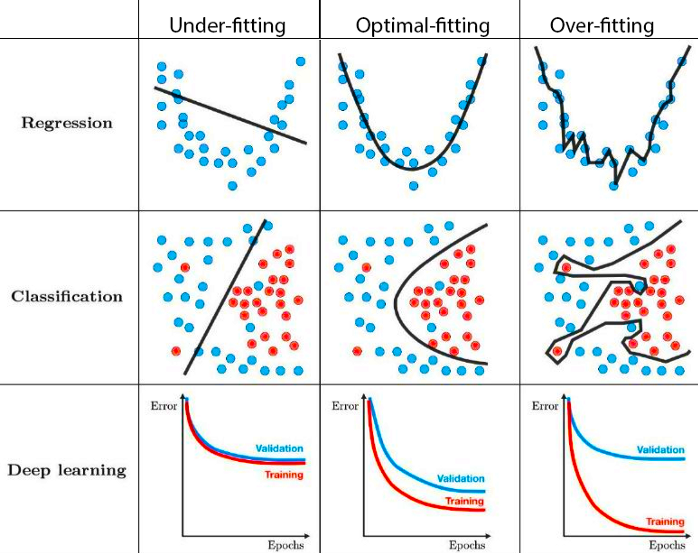
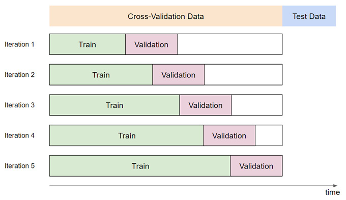

# Time Series Forecasting with Random Forest and XGBoost

This notebook guides you through the process of time series forecasting using Random Forest and XGBoost models in R. We'll use a sales dataset to demonstrate the techniques and then provide exercises for you to practice on different datasets.

## **Introduction to** Bagging and Boosting in Ensemble Learning

Ensemble learning combines multiple models to improve accuracy and robustness. Two popular ensemble methods are **bagging** and **boosting**.


**Figure 1: Overview of Bagging and Boosting**

## **1. Bagging: Reducing Variance**

**Bagging** (Bootstrap Aggregating) reduces the variance of a model by training multiple models on different bootstrapped samples of the data. The final prediction is made **by averaging (for regression) or majority voting (for classification)**. This reduces overfitting and improves stability.

**Random Forests** extend bagging by adding an additional layer of randomness. At each split in a decision tree, a random subset of features is selected. This further reduces correlation between trees, enhancing model accuracy and robustness. Random Forests work well when variance is the main issue, providing consistent performance across datasets. For instance, if we generate six decision trees using different bootstrapped samples from the Boston housing dataset, we get these decision trees.



**Figure 2: Six decision trees based on different bootstrap samples**

Bootstrapping is a statistical technique that involves resampling a dataset with replacement to estimate the sampling distribution of a statistic. It is commonly used to assess the accuracy (such as variance, bias, and confidence intervals) of estimates like the mean, median, regression coefficients, etc.



**Figure 3: Bootstrapping Process**


**Figure 4: Bagging Process**

### Setup and Data Loading

First, let's load the required libraries and our dataset.

```{r}
library(tidyverse)
library(lubridate)
library(tidymodels)
library(ranger)
library(xgboost)

# Load the data
data <- read.csv("https://raw.githubusercontent.com/deepshamenghani/time-series-regression-tidymodels/refs/heads/main/data/timeseries_data_single_storeproduct.csv")

head(data)

df <- data %>% 
  mutate(
    date = as.Date(date, format = "%m/%d/%Y"),
    year = year(date),
    semester = factor(semester(date)),
    quarter = factor(quarter(date)),
    day_in_week = factor(wday(date), labels = c("Sunday", "Monday", "Tuesday", "Wednesday", "Thursday", "Friday", "Saturday")),
    week_in_year = factor(week(date)),
    day_in_year = factor(yday(date)),
    month = factor(month(date), labels = month.name)
  )

head(df)
```

### Random Forest Implementation

Let's implement a Random Forest model for our time series forecasting task.

```{r}
# Load necessary libraries
library(tidyverse)
library(lubridate)
library(tidymodels)
library(modeltime)
library(ranger)
library(prophet)
library(glmnet)
library(xgboost)
library(timetk)


# Load the data
data <- read.csv("https://raw.githubusercontent.com/deepshamenghani/time-series-regression-tidymodels/refs/heads/main/data/timeseries_data_single_storeproduct.csv")

# 1. Preprocess the data
df <- data %>% 
  mutate(
    date = as.Date(date, format = "%m/%d/%Y"),
    year = year(date),
    semester = factor(semester(date)),
    quarter = factor(quarter(date)),
    day_in_week = factor(wday(date), labels = c("Sunday", "Monday", "Tuesday", "Wednesday", "Thursday", "Friday", "Saturday")),
    week_in_year = factor(week(date)),
    day_in_year = factor(yday(date)),
    month = factor(month(date), levels = 1:12, labels = month.name)
  )

# 2. Split the data into training and testing sets
splits <- initial_time_split(df, prop = 0.8)

# 3. Fit multiple models

# ARIMA model
model_fit_arima <- arima_reg(seasonal_period = 12) %>%
  set_engine("auto_arima") %>%
  fit(sales ~ date, data = training(splits))


# Random Forest model
model_rf <- rand_forest(trees = 500) %>%
  set_mode("regression") %>%
  set_engine("ranger") %>%
  fit(sales ~ ., data = training(splits) %>% select(-date))


# 4. Create modeltime table
models_table <- modeltime_table(
  model_fit_arima,
  model_rf
)

# 5. Evaluate models on training and testing sets
# Evaluate on training set
train_accuracy <- models_table %>%
  modeltime_calibrate(training(splits)) %>%
  modeltime_accuracy() %>%
  mutate(.type = "Train")

# Evaluate on testing set
test_accuracy <- models_table %>%
  modeltime_calibrate(testing(splits)) %>%
  modeltime_accuracy() %>%
  mutate(.type = "Test")

# Combine training and testing accuracy
model_accuracy <- bind_rows(train_accuracy, test_accuracy) %>%
  arrange(desc(rsq))

print("Model Accuracy Results (Train and Test):")
print(model_accuracy)

# 6. Visualize model comparison
model_accuracy <- model_accuracy %>%
  mutate(Model = rep(models_table$.model_desc, times = 2))  # Add model descriptions

rsq_plot <- model_accuracy %>%
  ggplot(aes(x = .model_desc, y = rsq, fill = .type)) +
  geom_col(position = position_dodge(width = 0.9)) +
  geom_text(aes(label = round(rsq, 3)), 
            vjust = -0.3, 
            position = position_dodge(width = 0.9), 
            size = 3.5) +
  labs(title = "Model Comparison - R-squared (Train vs Test)",
       x = "Model", y = "R-squared") +
  theme_minimal()

print(rsq_plot)

# 7. Forecast and plot
forecast_plot <- models_table %>%
 # modeltime_calibrate(testing(splits)) %>%
  modeltime_forecast(
    new_data    = testing(splits),
    actual_data = df
  ) %>%
  plot_modeltime_forecast(
    .interactive      = FALSE,
    .conf_interval_show = FALSE
  )

print(forecast_plot)

# 8. Save plots (optional)
# ggsave("rsq_comparison.png", plot = rsq_plot, width = 10, height = 6)
# ggsave("forecast_comparison.png", plot = forecast_plot, width = 12, height = 8)
```

Tree-based models like Random Forest and XGBoost often outperform traditional time series models (e.g., ARIMA) in complex scenarios, particularly with multidimensional data like product sales [5].

### Exercise 1: Random Forest on Air Passenger Dataset

For this exercise, we'll use the **Air Passenger Dataset**, which contains monthly totals of international airline passengers between 1949 and 1960. The goal is to predict future passenger numbers based on previous data.

```{r}
df_passengers = read_csv("https://raw.githubusercontent.com/aaubs/ds-master/main/data/air_passengers.csv", show_col_types = FALSE)

library(tibble)
colnames(df_passengers)

# Example: Renaming the "old_name" column to "new_name"
df_passengers <- rename(df_passengers, Passengers = '#Passengers')
colnames(df_passengers)

# Your task:
# 1. Preprocess the data by adding relevant time-based features
# 2. Split the data into training and testing sets
# 3. Fit multiple models
# 4. Create a workflow combining the models (Create modeltime table)
# 5. Evaluate models on training and testing sets
# 6. Visualize model comparison
# 7. Forecast and plot
# 8. Save plots (optional)
```

```{r}

```

## 2. Boosting**: Reducing Bias**

**Boosting** focuses on reducing bias by building models sequentially, where each model corrects the errors of the previous one. Boosting increases the importance of hard-to-predict cases, improving overall model performance.

**XGBoost** (Extreme Gradient Boosting) is a powerful boosting algorithm. It optimizes models through gradient descent and adds regularization to prevent overfitting. XGBoost is highly efficient and often delivers top performance in machine learning tasks by focusing on reducing bias and refining predictions.



**Figure 5: Boosting Process**

### XGBoost Implementation

Now, let's implement an XGBoost model for the same forecasting task.

```{r}
# Load necessary libraries
library(tidyverse)
library(lubridate)
library(tidymodels)
library(modeltime)
library(ranger)
library(prophet)
library(glmnet)
library(xgboost)

# Load the data
data <- read.csv("https://raw.githubusercontent.com/deepshamenghani/time-series-regression-tidymodels/refs/heads/main/data/timeseries_data_single_storeproduct.csv")

# 1. Preprocess the data
df <- data %>% 
  mutate(
    date = as.Date(date, format = "%m/%d/%Y"),
    year = year(date),
    semester = factor(semester(date)),
    quarter = factor(quarter(date)),
    day_in_week = factor(wday(date), labels = c("Sunday", "Monday", "Tuesday", "Wednesday", "Thursday", "Friday", "Saturday")),
    week_in_year = factor(week(date)),
    day_in_year = factor(yday(date)),
    month = factor(month(date), levels = 1:12, labels = month.name)
  )

# 2. Split the data into training and testing sets
splits <- initial_time_split(df, prop = 0.8)

# 3. Fit multiple models

# ARIMA model
model_fit_arima <- arima_reg() %>%
  set_engine("auto_arima") %>%
  fit(sales ~ date, data = training(splits))

# Random Forest model
model_rf <- rand_forest(trees = 500) %>%
  set_mode("regression") %>%
  set_engine("ranger") %>%
  fit(sales ~ ., data = training(splits) %>% select(-date))

# XGBoost model
model_xgb <- boost_tree(trees = 500, learn_rate = 0.05) %>%
  set_mode("regression") %>%
  set_engine("xgboost") %>%
  fit(sales ~ ., data = training(splits) %>% select(-date))

# 4. Create modeltime table
models_table <- modeltime_table(
  model_fit_arima,
  model_rf,
  model_xgb
)

# 5. Evaluate models on training and testing sets
# Evaluate on training set
train_accuracy <- models_table %>%
  modeltime_calibrate(training(splits)) %>%
  modeltime_accuracy() %>%
  mutate(.type = "Train")

# Evaluate on testing set
test_accuracy <- models_table %>%
  modeltime_calibrate(testing(splits)) %>%
  modeltime_accuracy() %>%
  mutate(.type = "Test")

# Combine training and testing accuracy
model_accuracy <- bind_rows(train_accuracy, test_accuracy) %>%
  arrange(desc(rsq))

print("Model Accuracy Results (Train and Test):")
print(model_accuracy)

# 6. Visualize model comparison
model_accuracy <- model_accuracy %>%
  mutate(Model = rep(models_table$.model_desc, times = 2))  # Add model descriptions

rsq_plot <- model_accuracy %>%
  ggplot(aes(x = .model_desc, y = rsq, fill = .type)) +
  geom_col(position = position_dodge(width = 0.9)) +
  geom_text(aes(label = round(rsq, 3)), 
            vjust = -0.3, 
            position = position_dodge(width = 0.9), 
            size = 3.5) +
  labs(title = "Model Comparison - R-squared (Train vs Test)",
       x = "Model", y = "R-squared") +
  theme_minimal()

print(rsq_plot)

# 7. Forecast and plot
forecast_plot <- models_table %>%
 # modeltime_calibrate(testing(splits)) %>%
  modeltime_forecast(
    new_data    = testing(splits),
    actual_data = df
  ) %>%
  plot_modeltime_forecast(
    .interactive      = FALSE,
    .conf_interval_show = FALSE
  )

print(forecast_plot)

# 8. Save plots (optional)
# ggsave("rsq_comparison.png", plot = rsq_plot, width = 10, height = 6)
# ggsave("forecast_comparison.png", plot = forecast_plot, width = 12, height = 8)
```

When working with complex datasets like product sales, the choice of model can greatly affect performance. Sales data often includes more than just time-based trends and simple temporal relationships. Pricing strategies, promotional activities, marketing campaigns, broader economic conditions, and seasonal patterns all contribute to the multidimensional nature of such data. In this context, tree-based models like Random Forest and XGBoost often shine. Their ability to leverage a wide array of features, both temporal and non-temporal, allows them to capture the intricate interplay of factors influencing sales. These models can efficiently handle complex interactions and nonlinear effects, making them well-suited for scenarios where sales might be influenced by a combination of price points, promotional timing, and external economic indicators.

## Comparing Model Performance: Statistical Time Series vs Classical ML-Based Models

1.  **Handling Non-linearity**: Classical ML-Based models are often more adept at capturing non-linear relationships in data compared to traditional statistical time series models [5][6].

2.  **Feature Incorporation**: Classical ML-Based models can more easily incorporate a wide range of features, including non-temporal predictors, which can be challenging for traditional time series models [2][5].

3.  **Scalability**: With large datasets, Classical ML-Based models often show superior performance, as highlighted in the "size matters" concept [5].

4.  **Handling Irregularities**: Classical ML-Based models are generally more robust to outliers and can handle irregular patterns in data more effectively [6].

5.  **Non-Parametric Approach**: Classical ML-Based models, being non-parametric, offer a significant advantage in their flexibility to fit a wide range of data distributions without making strong assumptions about the underlying data generation process [7][8].

### Exercise 2: XGBoost on Air Passenger Dataset

For this exercise, we'll use the **Air Passenger Dataset**, which contains monthly totals of international airline passengers between 1949 and 1960. The objective is to build a predictive model using the XGBoost algorithm to forecast future passenger numbers.

```{r}
df_passengers = read_csv("https://raw.githubusercontent.com/aaubs/ds-master/main/data/air_passengers.csv", show_col_types = FALSE)

library(tibble)
colnames(df_passengers)

# Example: Renaming the "old_name" column to "new_name"
df_passengers <- rename(df_passengers, Passengers = '#Passengers')
colnames(df_passengers)
# Your task:
# 1. Preprocess the data by adding relevant time-based features
# 2. Split the data into training and testing sets
# 3. Fit multiple models
# 4. Create a workflow combining the models (Create modeltime table)
# 5. Evaluate models on training and testing sets
# 6. Visualize model comparison
# 7. Forecast and plot
# 8. Save plots (optional)
```

```{r}
summary(df_passengers)

```

```{r}

```

# Overfitting in ML: Understanding and Mitigation

Overfitting occurs when a machine learning model learns the training data too well, including its noise, leading to poor generalization on new data. This phenomenon is akin to a student memorizing specific exam questions rather than understanding underlying concepts. Let me explain:

Imagine you are a student preparing for a big exam. You have the entire textbook to study from, and you also have some practice questions. Overfitting happens when a student tries to memorize every single detail of the practice questions instead of understanding the concepts. They are very focused on remembering everything exactly as it is without understanding why things work the way they do. If the exam questions are *exactly* the same as the practice questions, this student might do very well. But if the questions are even slightly different, they’ll struggle because they didn’t learn the concepts; they just memorized answers. **In Machine Learning** overfitting occurs when the model is too complex, capturing every nuance and noise in the training data. This results in great performance on the training set but poor generalization to new data, as shown in the image where the model's decision boundaries are very complicated.

### 

**Figure 6: overfitting**

How to mitigate overfitting issue in the ML models

To bridge this gap, in ML models for time series projects, there are differnt techniques that can be categorized into these three approaches:

-   **Feature Engineering:** Random Forest and XGBoost are better suited for non-temporal, tabular data unless specific adaptations are made. Time-series data has an inherent temporal structure, and these algorithms may struggle to capture dependencies between time points effectively without feature engineering that encodes these relationships (e.g., lagged variables, trends, or seasonal features). In contrast, ARIMA, Prophet, and TBATS are specifically designed to model time-series data, which includes trends, seasonality, and lags. These models are better equipped to understand the temporal relationships in the data.

-   **Cross-validation:** Cross-validation plays a vital role in assessing a model's performance and its propensity for overfitting. However, traditional cross-validation techniques often need modification for time series data to respect its temporal nature. Approaches like rolling window validation or time series split can help ensure that the model's performance is evaluated in a way that mimics real-world scenarios, where future data is truly unseen.

-   **Hyperparameter Tuning:** Hyperparameter tuning is another critical aspect of mitigating overfitting, particularly for ensemble methods like Random Forest and XGBoost. This process involves systematically adjusting the model's configuration to find the optimal balance between fitting the training data and maintaining generalizability. Key parameters often tuned include the depth of decision trees, which controls the model's complexity; the learning rate, which influences how quickly the model adapts to the training data; and the number of trees in the ensemble, which affects the model's ability to capture complex patterns while avoiding overfitting.These steps could help improve the accuracy of Random Forest and XGBoost for time-series forecasting tasks.

## Feature Engineering

Random Forest and XGBoost are better suited for non-temporal, tabular data unless specific adaptations are made. Time-series data has an inherent temporal structure, and these algorithms may struggle to capture dependencies between time points effectively without feature engineering that encodes these relationships (e.g., lagged variables, trends, or seasonal features). In contrast, ARIMA, Prophet, and TBATS are specifically designed to model time-series data, which includes trends, seasonality, and lags. These models are better equipped to understand the temporal relationships in the data.

```{r}
# Load necessary libraries
library(tidyverse)
library(lubridate)
library(tidymodels)
library(modeltime)
library(ranger)
library(prophet)
library(glmnet)
library(xgboost)
library(tsibble)
library(tibble)
library(slider)  # Added for sliding functions

# Load the data
df_passengers <- read_csv("https://raw.githubusercontent.com/aaubs/ds-master/main/data/air_passengers.csv", show_col_types = FALSE)
df_passengers <- rename(df_passengers, Passengers = '#Passengers')

# 1. Preprocess the data
df_passengers <- df_passengers %>% 
  mutate(
    date = ym(Month),  # Corrected date parsing using 'ym' from lubridate
    year = year(date),
    semester = factor(semester(date)),
    quarter = factor(quarter(date)),
    month = factor(month(date), levels = 1:12, labels = month.name)
  ) %>%
  mutate(across(where(is.character), as.factor)) %>%
  drop_na()

# Create lag features and rolling averages
df_passengers <- df_passengers %>%
  mutate(
    lag_1 = lag(Passengers, 1),  # Lag of 1 month: Create lagged features to incorporate the influence of previous months' passenger numbers.
    lag_2 = lag(Passengers, 2),
    lag_3 = lag(Passengers, 3),
    lag_3 = lag(Passengers, 4),
    lag_12 = lag(Passengers, 12),  # Lag of 12 months to capture yearly seasonality
    lag_6 = lag(Passengers, 6),     # Lag of 6 months
    rolling_avg_4 = slide_dbl(Passengers, mean, .before = 3, .complete = TRUE),  # 4-month rolling average: Create a rolling average feature to smooth short-term fluctuations and highlight long-term trends.
    rolling_diff_4 = Passengers - rolling_avg_4  # Difference from rolling average
  ) %>%
  drop_na()  # Remove rows with NA due to lagging

# Add dummy variables for holidays (assuming holiday dummy is available)
df_passengers <- df_passengers %>%
  mutate(
    holiday = if_else(month %in% c("December", "January"), 1, 0)  # Assuming holidays are in December and January
  )

# 2. Split the data into training and testing sets
splits <- initial_time_split(df_passengers, prop = 0.8)

# 3. Fit multiple models

# ARIMA model
model_fit_arima <- arima_reg() %>%
  set_engine("auto_arima") %>%
  fit(Passengers ~ date, data = training(splits)) 

# Random Forest model
model_rf <- rand_forest(trees = 500) %>%
  set_mode("regression") %>%
  set_engine("ranger") %>%
  fit(Passengers ~ . - date, data = training(splits))  # Exclude 'date' column

# XGBoost model
model_xgb <- boost_tree(trees = 500, learn_rate = 0.05) %>%
  set_mode("regression") %>%
  set_engine("xgboost") %>%
  fit(Passengers ~ . - date, data = training(splits))  # Exclude 'date' column

# 4. Create modeltime table
models_table <- modeltime_table(
  model_fit_arima,
  model_rf,
  model_xgb
)

# 5. Evaluate models on training and testing sets
# Evaluate on training set
train_accuracy <- models_table %>%
  modeltime_calibrate(training(splits)) %>%
  modeltime_accuracy() %>%
  mutate(.type = "Train")

# Evaluate on testing set
test_calibration <- models_table %>%
  modeltime_calibrate(testing(splits))

test_accuracy <- test_calibration %>%
  modeltime_accuracy() %>%
  mutate(.type = "Test")

# Combine training and testing accuracy
model_accuracy <- bind_rows(train_accuracy, test_accuracy)

print("Model Accuracy Results (Train and Test):")
print(model_accuracy)

# 6. Visualize model comparison
model_accuracy <- model_accuracy %>%
  mutate(Model = rep(models_table$.model_desc, times = 2))  # Add model descriptions

rsq_plot <- model_accuracy %>%
  ggplot(aes(x = Model, y = rsq, fill = .type)) +
  geom_col(position = position_dodge(width = 0.9)) +
  geom_text(aes(label = round(rsq, 3)), vjust = -0.5, position = position_dodge(width = 0.9)) +
  labs(title = "Model Comparison - R-squared (Train vs Test)",
       x = "Model", y = "R-squared") +
  theme_minimal()

print(rsq_plot)

# 7. Forecast and plot
forecast_plot <- test_calibration %>%
  modeltime_forecast(
    new_data    = testing(splits),
    actual_data = df_passengers
  ) %>%
  plot_modeltime_forecast(
    .interactive      = FALSE,
    .conf_interval_show = FALSE
  )

print(forecast_plot)

# 8. Save plots (optional)
# ggsave("rsq_comparison.png", plot = rsq_plot, width = 10, height = 6)
# ggsave("forecast_comparison.png", plot = forecast_plot, width = 12, height = 8)

```

## Hyper-parameter Tuning and Cross Validation

-   **Cross-validation:** Cross-validation plays a vital role in assessing a model's performance and its propensity for overfitting. However, traditional cross-validation techniques often need modification for time series data to respect its temporal nature. Approaches like rolling window validation or time series split can help ensure that the model's performance is evaluated in a way that mimics real-world scenarios, where future data is truly unseen.



-   **Hyperparameter Tuning:** Hyperparameter tuning is another critical aspect of mitigating overfitting, particularly for ensemble methods like Random Forest and XGBoost. This process involves systematically adjusting the model's configuration to find the optimal balance between fitting the training data and maintaining generalizability. Key parameters often tuned include the depth of decision trees, which controls the model's complexity; the learning rate, which influences how quickly the model adapts to the training data; and the number of trees in the ensemble, which affects the model's ability to capture complex patterns while avoiding overfitting.These steps could help improve the accuracy of Random Forest and XGBoost for time-series forecasting tasks.

```{r}
# Load necessary libraries
library(tidyverse)
library(lubridate)
library(caret)
library(gbm)
library(modeltime)
library(tidymodels)
library(ranger)
library(prophet)
library(glmnet)
library(xgboost)
library(tsibble)
library(tibble)
library(slider)


# 1. Set up cross-validation control
fitControl <- trainControl(
  method = "repeatedcv",
  number = 4,
  repeats = 4
)

# 2. Train the GBM model
set.seed(825)
gbmFit1 <- train(
  Passengers ~ . - date,  # Exclude 'date' from predictors
  data = training(splits),
  method = "gbm",
  trControl = fitControl,
  verbose = FALSE
)
print(gbmFit1)

# 3. Plot model performance
trellis.par.set(caretTheme())
plot(gbmFit1)  # Use plot() instead of ggplot()

# 4. Predict on the test set
actual_values <- testing(splits)$Passengers
predicted_values <- predict(gbmFit1, newdata = testing(splits))

# 5. Print the first few predictions and actual values
print("Predicted Values:")
head(predicted_values)
print("Actual Values:")
head(actual_values)

# 6. Calculate RMSE and R-squared
metrics <- postResample(pred = predicted_values, obs = actual_values)
rmse_value <- metrics["RMSE"]
rsquared_value <- metrics["Rsquared"]

print(paste("RMSE:", rmse_value))
print(paste("R-squared:", rsquared_value))

```

```{r}
# Load necessary libraries
library(tidyverse)
library(lubridate)
library(caret)
library(gbm)
library(modeltime)
library(xgboost)

# Ensure other necessary packages are loaded
library(tidymodels)
library(ranger)
library(prophet)
library(glmnet)
library(tsibble)
library(tibble)
library(slider)

# Assuming 'df_passengers' and 'splits' are already defined as in your previous code

# 1. Set up cross-validation control (same as before)
fitControl <- trainControl(
  method = "repeatedcv",
  number = 4,
  repeats = 3
)

# 2. Preprocess data to handle factor variables
# Caret will handle dummy variable creation if we specify preProcess = "dummyVars"

# 3. Train the XGBoost model
set.seed(825)
xgbFit <- train(
  Passengers ~ . - date,  # Exclude 'date' from predictors
  data = training(splits),
  method = "xgbTree",
  trControl = fitControl
  )

print(xgbFit)

# 4. Plot model performance
plot(xgbFit)  # Plot the performance metrics

# 5. Predict on the test set
# Ensure that the same preprocessing is applied to the test set
test_data <- testing(splits)

# Predict on the test set
predicted_values <- predict(xgbFit, newdata = test_data)

# Actual values
actual_values <- test_data$Passengers

# 6. Print the first few predictions and actual values
print("Predicted Values:")
head(predicted_values)
print("Actual Values:")
head(actual_values)

# 7. Calculate RMSE and R-squared
metrics <- postResample(pred = predicted_values, obs = actual_values)
rmse_value <- metrics["RMSE"]
rsquared_value <- metrics["Rsquared"]

print(paste("RMSE:", rmse_value))
print(paste("R-squared:", rsquared_value))

```

## Exercise 3: Time Series Analysis of Energy Load and Generation in Germany

```{r}
# Load the dataset
df_energy <- read_csv('/Users/gy22ge/Downloads/time_series_60min_singleindex_filtered.csv')


head(df_energy)
# Your task:
# 1. Preprocess the data by adding relevant time-based features
# 2. Split the data into training and testing sets
# 3. Fit multiple models
# 4. Create a workflow combining the models (Create modeltime table)
# 5. Evaluate models on training and testing sets
# 6. Visualize model comparison
# 7. Forecast and plot
# 8. Save plots (optional)
```

```{r}

```

## Exercise 4: Time Series Analysis of Stock Prices for Tesla (TSLA)

```{r}
library(quantmod)
library(tseries)
indf_data <- getSymbols(Symbols = "TSLA", src = "yahoo", from = Sys.Date() - 2017, 
                        to = Sys.Date(), auto.assign = FALSE)
indf_data <- na.omit(indf_data)
indf_data
chart_Series(indf_data, col = "black")
# Your task:
# 1. Preprocess the data by adding relevant time-based features
# 2. Split the data into training and testing sets
# 3. Fit multiple models
# 4. Create a workflow combining the models (Create modeltime table)
# 5. Evaluate models on training and testing sets
# 6. Visualize model comparison
# 7. Forecast and plot
# 8. Save plots (optional)
```

```{r}

```

### References

1.  Hawkins, D. M. (2004). The problem of overfitting. Journal of Chemical Information and Computer Sciences, 44(1), 1-12.

2.  Christ, M., Braun, N., Neuffer, J., & Kempa-Liehr, A. W. (2018). Time Series FeatuRe Extraction on basis of Scalable Hypothesis tests (tsfresh–A Python package). Neurocomputing, 307, 72-77.

3.  Bergmeir, C., Hyndman, R. J., & Koo, B. (2018). A note on the validity of cross-validation for evaluating autoregressive time series prediction. Computational Statistics & Data Analysis, 120, 70-83.

4.  Probst, P., Wright, M. N., & Boulesteix, A. L. (2019). Hyperparameters and tuning strategies for random forest. Wiley Interdisciplinary Reviews: Data Mining and Knowledge Discovery, 9(3), e1301.

5.  Cerqueira, V., Torgo, L., & Soares, C. (2019). Machine learning vs statistical methods for time series forecasting: Size matters. Machine Learning, 108(5), 809-840.

6.  Jiang, W., & Jiang, Y. (2021). A comparative study of tree-based and ARIMA models for air passenger traffic forecasting. Transportation Research Interdisciplinary Perspectives, 10, 100391.

7.  Breiman, L. (2001). Random Forests. Machine Learning, 45(1), 5-32.

8.  Friedman, J., Hastie, T., & Tibshirani, R. (2009). The Elements of Statistical Learning. Springer Series in Statistics.

9.  Quinlan, J. R. (1993). C4.5: Programs for Machine Learning. Morgan Kaufmann Publishers.

10. Hastie, T., Tibshirani, R., & Friedman, J. (2001). The Elements of Statistical Learning: Data Mining, Inference, and Prediction. Springer.

11. Efron, B., & Tibshirani, R. J. (1994). An Introduction to the Bootstrap. CRC Press.
